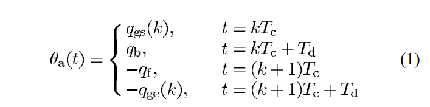

# Planning Walking Patterns for a Biped Robot

by Qiang Huang _et al_,  2001  [Paper Link](https://ieeexplore.ieee.org/document/938385)

summarized by Peijie Xu

## 0. Abstract 

| Step    |                      Action                                        |  Result    |
| :--: | ------------------------------------------------------------ | ---- |
|   1   | formulate the constraints of the foot motion parameters | produce different types of foot motion to adapt to ground conditions |
| 2 | formulate the problem of the smooth hip motion with the largest stability margin using only two parameters | derive the hip trajectory by iterative computation |
| 3 | correlation between the actuator  specifications and the walking patterns is described through simulation studies | the effectiveness of the proposed methods is confirmed by **simulation** examples and experimental results |

## 1. Introduction

This paper describes a proposed method for planning walking patterns, which includes the ground conditions, dynamic stability constraint, and relationship between walking patterns and actuator specifications.

  

## 2. Walking Cycle

### The Target Biped Robot

The humanoid biped robot with a trunk, which has 6 DOF: 3 in hip, 1 in  knee, and 2 in ankle.

### Biped Walking Definition

Biped walking is periodic, which is composed of 2 phases, listed below:

|     Phase      | Action                                                       |
| :---------------------------------: | ---------------------------------------------- |
| double-support | begins with the heel of the forward foot touching the ground, ends with the toe of the rear foot leaving the ground |
| single-support | while one foot is stationary on the ground, the other foot swings from the rear to the front |

The interval of the double-support phase in human locomotion is about **20%**, the author use this value as the basis of following calculation.

### Assumption

The walking pattern can be denoted uniquely by both foot trajectories and the hip trajectory. 

When the robot moves straightforward, the lateral positions of both feet are constant. The lateral hip motion can be obtained similarly as the sagittal hip motion as discussed in Section IV. 

In the following sections, **only discuss trajectories in the sagittal plane**.

### Definition

For a sagittal plane (see Fig 1):

​	each foot trajectory can be denoted by a vector $X_a=[x_a(t),z_a(t),\theta_a(t)]^T$, where $$(x_a(t),z_a(t))$$ is the ankle position, $\theta_a(t)$ is the angle of the foot

​	hip trajectory can be denoted by a vector $X_h=[x_h(t),z_h(t),\theta_h(t)]^T$, where $$(x_h(t),z_h(t))$$ denotes the coordinate of the hip position and $$\theta_h(t)$$ denotes the angle of the hip

We need first specify both foot trajectories, then determine the hip trajectory.

## 3. Foot Trajectories

### Definitions

In the following, only discuss **the generation of the right foot trajectory**.

$T_c$ : the period of 1 walking step

$kT_c$ ~ $(k+1)T_c$: time of *k* th step

_k_ th walking step (see Fig 2): begin with **the heel of the right foot leaving the ground**, end with **the heel of the right foot making first contact with the ground**

$q_b$ and $q_f$: angles of the right foot as it leaves and lands on the ground

### The 6+1 Constraints

#### Constraints of angle of ankle

where 

​	$T_d$ is the interval of the double-support phase, 

​	$q_{gs}(k)$ and $q_{ge}(k)$ are the angles of the ground under the **support foot**

$(L_{a0},H_{a0})$: the position of the highest point of the swing foot (to avoid obstacles)

#### Constraints of kinematic

where 

​	$D_s$ is the length of one step,  

​	$k T_c+T_m$ is the time when the right foot is at its highest point, 

​	$l_{an}$ is the height of the foot,

​	$l_{af}$ is  the length from the ankle joint to the toe,

​	$l_{ab}$ is the length from the ankle joint to the heel, 

​	$h_{gs}(k)$ and $h_{ge}(k)$ are the heights of the ground surface which is under the support foot

#### Another constraints

Because the entire sole surface of the right foot is in contact with the ground at $t=k T_s$ and $t=(k+1)T_c+T_d$ 

#### Smooth constraints

A smooth trajectory also requires $x_a(t),z_a(t),\theta_a(t)$ to be **1st order differential and 2nd order continuous** at all time.

**Obtain the foot trajectory using 3rd-order spline interpolation**

## 4. Hip Trajectory

### Assumption

$\theta_h(t)$ is constant when there is no waist joint (at value of $0.5\pi$ rad)

Hip motion $z_h(t)$ hardly affects the position of the ZMP. We can specify $z_h(t)$ to be constant, or to vary within a fixed range
