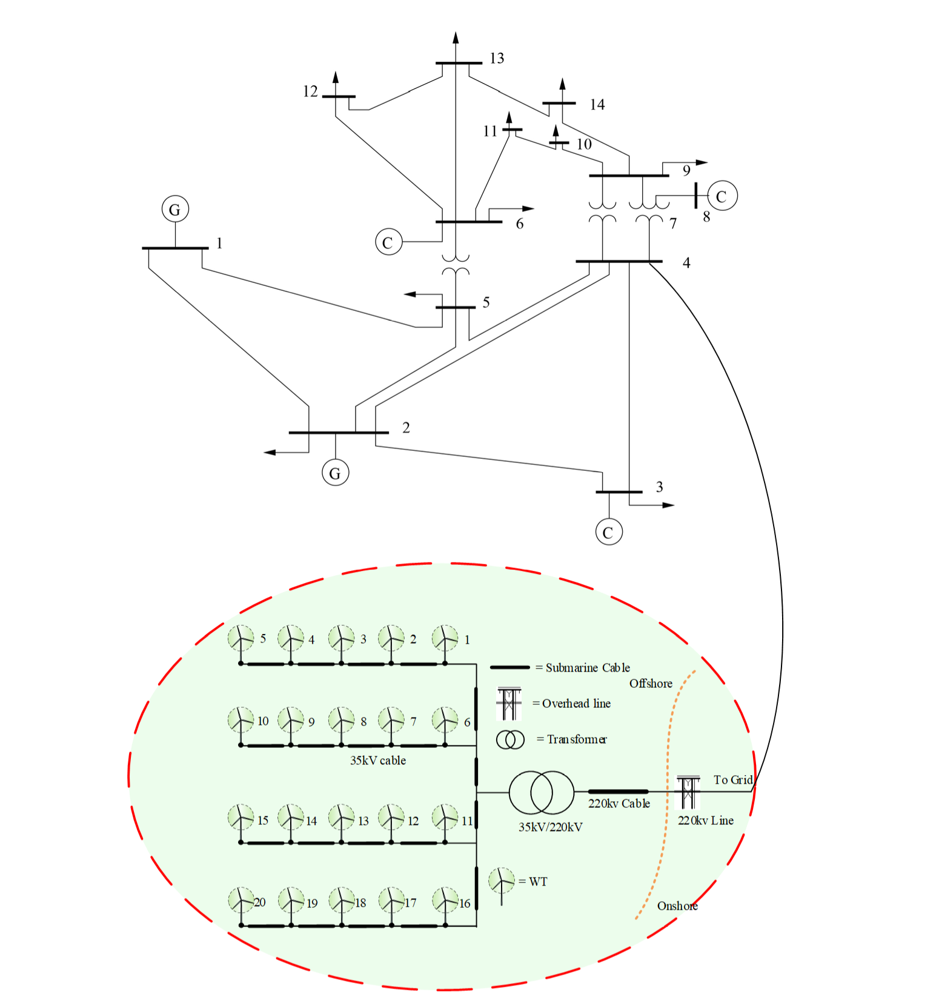
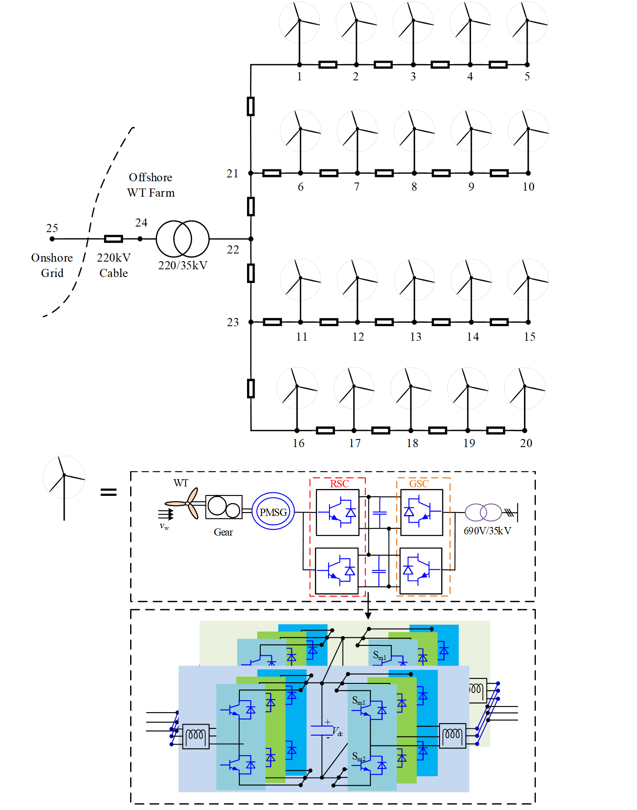
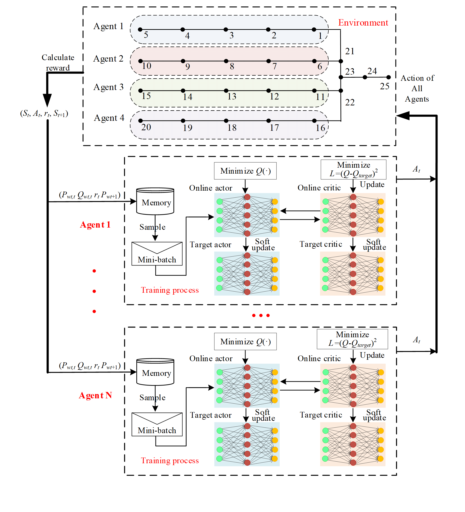
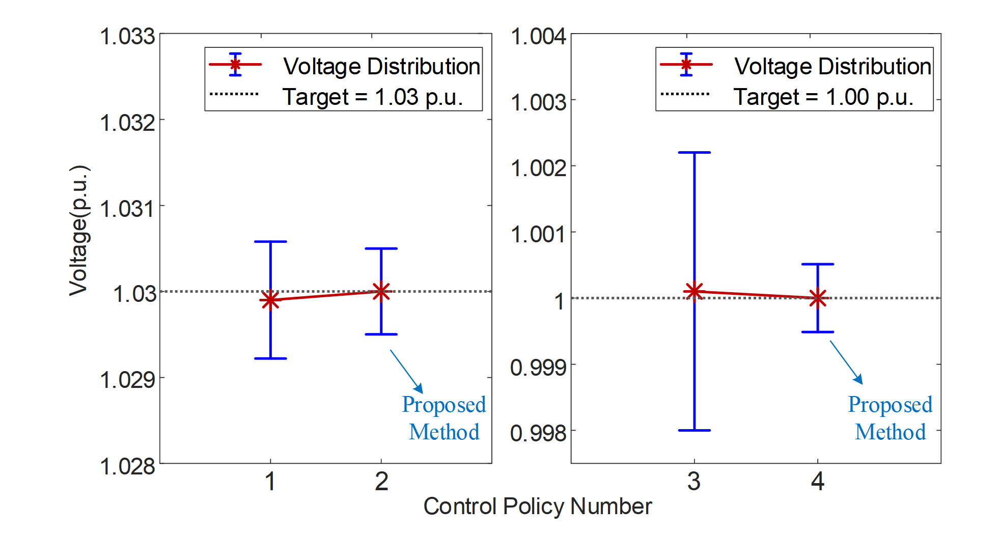
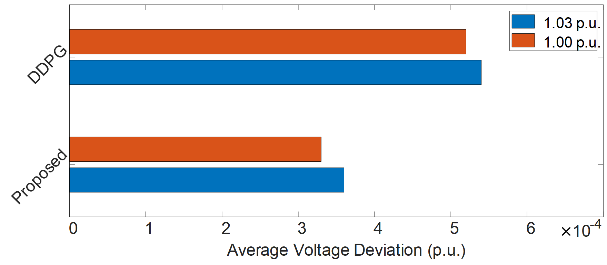

[Home](../index.html) / [Project List](Projects_index.html) / Multi-Agent DRL
  
## Deep Reinforcement Learning (DRL) - Guided Offshore Wind Farm Voltage Control

_Undergraduate Thesis Project_   
_Supervisor: Prof. Hui Li_  
_Lab: [State Key Laboratory of PES](http://sklpe.cqu.edu.cn/)_

* Applied DRL to minimize the Average Voltage Deviation (AVD) of the offshore wind farm; the work was awarded the outstanding undergraduate thesis of CQU (top 1.5% in the university)

*	Built reactive power-voltage optimization model and formulated it as a Markov Decision Process; established the agents’ actor & critic’s Deep Neural Network and the interactive environment of RL; trained the agents with adapted Deep Deterministic Policy Gradient (DDPG) and Multi-Agent DDPG
   
*	Decreased AVD by 11.48 % after adding the forward difference of active power into observation; decreased AVD to 5.4×10-4 p.u. and 3.6×10-4 p.u. using policy trained by DDPG-based and Multi-Agent DDPG-based method respectively, which means the proposed multi-agent-based method improves the control performance by 33.33 %  

* <a href="doc/Brief Intro to Undergraduate Thesis.pdf" target="Peijie Xu" > <b>A Brief Introduction to My Thesis</b> (pdf)</a>
* <a href="https://aistudio.baidu.com/aistudio/projectdetail/1811882?lang=en" target="Peijie Xu" > <b>DDPG source code</b> </a>
* <a href="https://aistudio.baidu.com/aistudio/projectdetail/1907893?lang=en" target="Peijie Xu" > <b>MADDPG source code</b></a>
  
<table><tr>
<td></td>
<td></td>
</tr></table> 

<i>The structure of the wind farm</i>

    

<i>The multi-agent DDPG-based approach</i>

  

    

<i>Result</i>

    

<i>Comparation of proposed multi-agent approch and normal DDPG</i>

  
