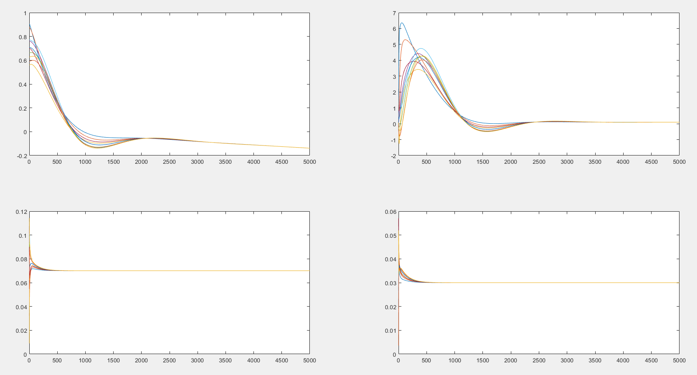

[Home](../index.html) / [Project List](Projects_index.html) / Multi-Agent Consensus Control 

## Wind Farm Multi-Agent Consensus Control

_Research Assistant_   
_Supervisor: Prof. Minyou Chen_  

* Investigated control methods for a distributed wind farm system

* Formulated the target wind farm as a graph; designed and simulated a distributed consensus algorithm to regulate output power of 10 doubly-fed induction generators-based wind turbines with on-site battery energy storage systems 

