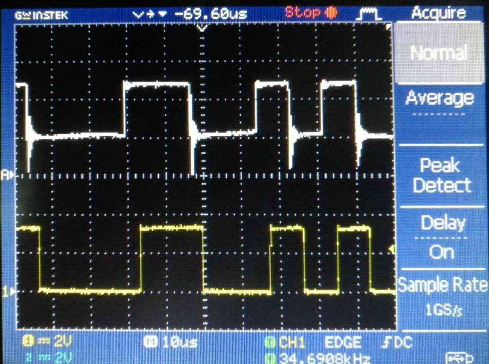

[Home](../index.md) / [Projects](Projects_index.html) / VLC
  
## Electrical Compensation Technology for Visible Light Communication (VLC)
_Leader_   
_Supervisor: Prof.Quanming, Luo_  
  
* Visible Light Communication (VLC) is a new communication method, which is a kind of optical wireless communication technology that uses the light visible to human eyes as information carrier to carry out data transmission in free space. It is characterized by low cost, green environment protection, no RF interference, rich spectrum, high confidentiality and etc., also it is harmless to human body. The unique advantages of VLC equip it a good application prospect in many fields.
  
* In this project, we designed a VLC system. The system sends information through the upper computer, and the encoded information is sent into the drive modulation circuit after passing through the USB to TTL module, so that the LED array sends information to the light receiving terminal. At the receiving terminal, the signal is transmitted back to the lower computer via TTL to USB module after processing, then the lower computer displays the communication content after decoding.
  
* The power supply of the VLC system contains 2 options - constant voltage source and constant current source. The LED array is changeable and works as a scattering light source, when the system relies on the constant voltage source works at a baud rate of 256kbps, the communication distance reaches as far as 0.4 m; as the system relies on the constant current source works at a baud rate of 1200 bps, the communication distance reaches as far as 0.1m.

    

<i>The VLC System</i>

<table><tr>
<td></td>
<td></td>
</tr></table> 

<i>The Sending Terminal (TX) and its Circuit(Constant Voltage Source)</i>

    

<i>The Receiving Terminal (RX) </i>

    

<i>The Wave of two terminal (white: TX, yellow: RX)</i>

