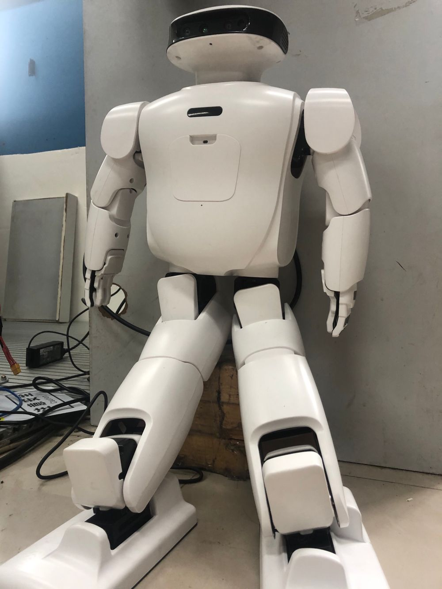
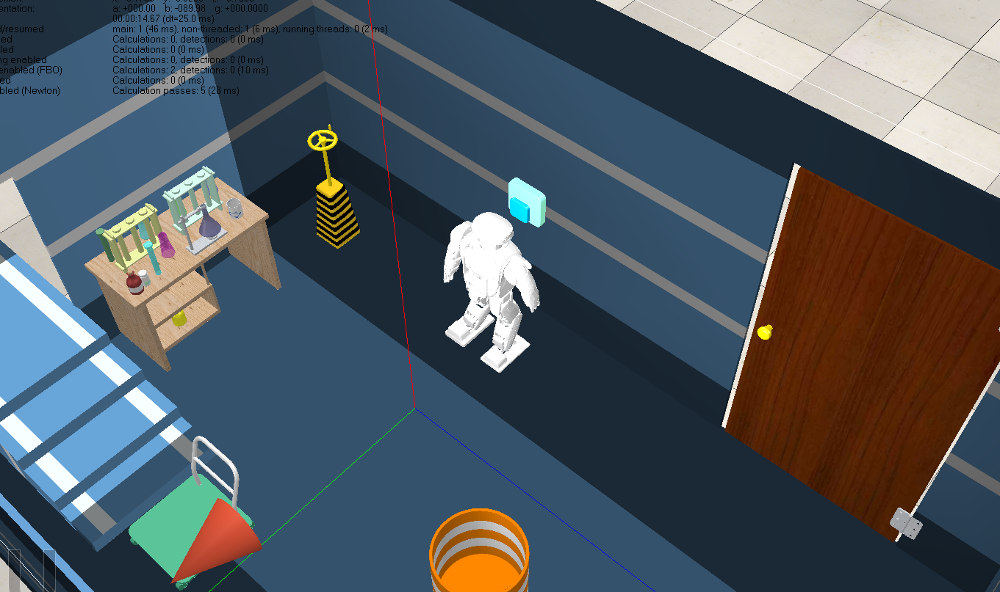
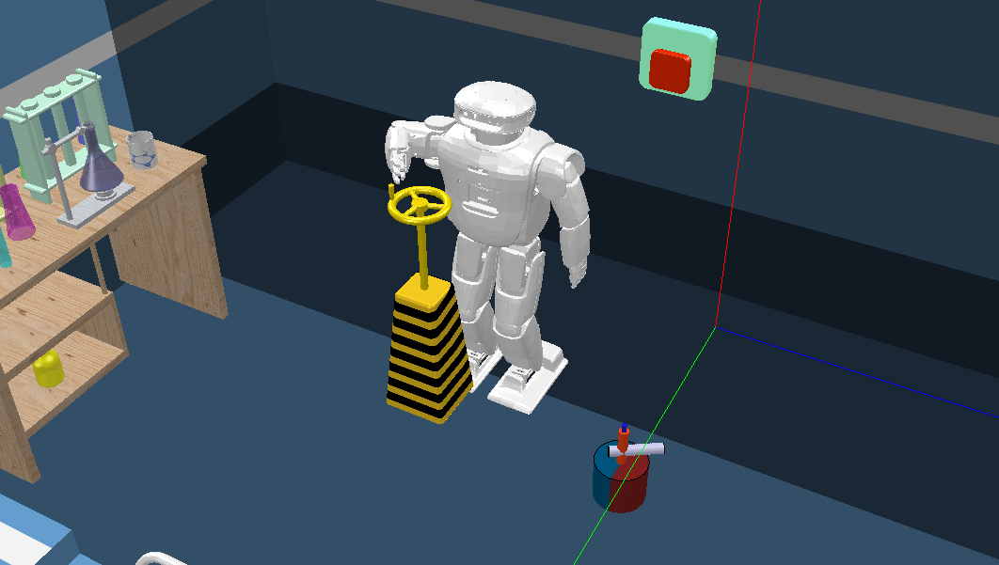

[Home](../index.html) / [Project List](Projects_index.html) / Humanoid Robot

## Humanoid Robot Visual SLAM and Control System Programming 

_Research Assistant_   
_Supervisor: Prof. Yongduan Song & Niu Wang_  

* Control the humanoid robot Roban to finish a sequence of tasks required by [BOTEC](http://botec.hitsz.edu.cn/index.htm)

* Developed a localization, mapping, and navigation system based on ORB, OctoMap, and move_base

* Built the robot’s model in CoppeliaSim/V-REP to simulated the control algorithm; controlled the gait using a dynamic model which derived from Lagrangian dynamics when it stands on one leg

<video style="max-width: 320px;" controls="controls">
  <source src="pic/4_walk.mp4" type="video/mp4" />
</video>

    

<i>The Robot</i>

<i>Robot Simulation (in V-REP)</i>

	
	
		<a href="#content">
			<b> Back to Top </b>
		</a>
	
	

	

